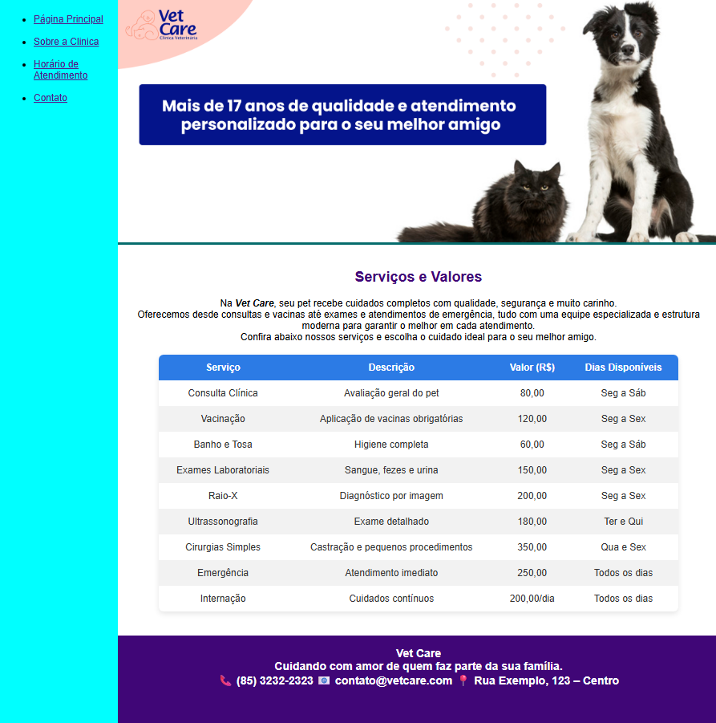

# 💻 Primeiro Site Completo com HTML

Este projeto foi desenvolvido como parte da minha jornada de aprendizado em desenvolvimento web, através da plataforma DIO (Digital Innovation One).

## 🚀 Sobre o projeto
Neste projeto, desenvolvi um site completo utilizando HTML e alguns poucos recursos de CSS, aplicando na prática conceitos como:

- Estruturação de páginas
- Uso semântico de tags HTML
- Criação de formulários
- Inserção de mídias (imagens, vídeos, etc.)
- Inserção de Iframe com o Google Maps

## 🎯 Objetivo
Consolidar os conhecimentos iniciais de HTML e compreender como estruturar uma aplicação web funcional.

## 🛠️ Tecnologias utilizadas
- HTML5

## 🖼️ Preview do Projeto

  

## 📚 Aprendizados
Esse projeto foi fundamental para reforçar minha base no desenvolvimento Front-End, permitindo transformar teoria em prática.

## 🔗 Acesse o repositório
[Clique aqui para visualizar o código](https://github.com/tenoriodsouza-svg/desafio_dio_primeiro_site_completo)

---

📌 Projeto desenvolvido por Andrei Tenorio de Souza  
🚀 Em transição de carreira para Desenvolvimento Web
